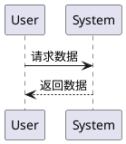

# 思源书写规范

适用场景：写入思源文档时，需要用到引用、嵌入块、Callout、Mermaid、ECharts、kramdown 属性等思源特有语法。常规 Markdown（标题、列表、普通表格、代码块）按主流方言书写即可，本文不再赘述。

所有示例的写入命令统一用 `siyuan-sisyphus block append` / `siyuan-sisyphus fs write`，传入 `--data-type markdown` 与字符串字面量。

## 内容块基础

每个内容块有全局唯一 ID，格式：`YYYYMMDDHHMMSS-xxxxxxx`（时间戳 + 7 位随机），如 `20240813004931-q4cu8na`。

常用块类型（与 `blocks.type`、SQL 中的取值对应）：

| 类型 | 含义 | type 字段 |
| --- | --- | --- |
| 文档块 | 文档自身 | `d` |
| 标题块 | `#`/`##` 等 | `h` |
| 段落块 | 普通段落 | `p` |
| 列表块 | 有序/无序/任务 | `l` |
| 列表项 | 列表内单项 | `i` |
| 引述块 | `>` 块 | `b` |
| 代码块 | 三反引号 | `c` |
| 表格块 | `|` 表格 | `t` |
| 数学块 | `$$` 公式 | `m` |
| 超级块 | `{{{row/col}}}` | `s` |

容器块（可包含其它块）：文档块、列表块、引述块。

## 块引用（思源专有）

```
((块ID "锚文本"))   // 静态锚文本：固定显示
((块ID '锚文本'))   // 动态锚文本：跟随定义块更新
```

写入示例：

```bash
siyuan-sisyphus block append --parent-id <docId> --data-type markdown --data "相关阅读：((20240813004931-q4cu8na '什么是内容块'))"
```

要点：

- 锚文本必须用双引号或单引号包裹；单引号 = 动态。
- 不要写成标准 Markdown `[文本](id)`。需要用标准链接时格式为 `[标题](siyuan://blocks/<docId>)`。
- 用文档/块 ID 锁定，避免标题改名后链接失效。
- 思源编辑器里 `((` 触发块引用搜索，`[[` 触发文档引用搜索（需先在「设置 → 编辑器 → `[[` 仅搜索文档」开启）。CLI 写入时只用最终的 `((id ...))` 字面量。
- 动态锚文本最长 5120 字符，可在思源「设置 → 锚文本 → 块引动态锚文本最大长度」调整。

## 嵌入块（动态查询）

```
{{ SELECT 语句 }}
```

写入示例：

```bash
siyuan-sisyphus block append --parent-id <docId> --data-type markdown --data "{{ SELECT * FROM blocks WHERE type='p' AND content!='' AND root_id!='<当前 docId>' ORDER BY updated DESC LIMIT 5 }}"
```

要点：

- 嵌入块**必须独占一行**，与上一段中间留空行。
- 只能渲染 `blocks` 表的行（每行就是一个内容块）。SQL 内可 `JOIN attributes / refs / spans` 等辅助筛选，但 `SELECT` 列表必须是 `blocks` 的列（或 `blocks.*`），用 `SELECT *` 最稳——思源渲染需要 id/markdown/type/... 等多列，缺列会显示空白卡片。
- 真实陷阱一：当前文档自身往往也命中查询条件，结果列表里会出现"自己嵌入自己"。在 `WHERE` 加 `AND root_id != '<当前 docId>'` 排除。
- 真实陷阱二：要查任务勾选状态（`- [ ]` / `- [x]`）必须用 `markdown` 字段，不要用 `content`（content 已剥离 markdown 标记）。
- 真实陷阱三：SQL 命中但 UI 显示"不存在符合条件的内容块"——嵌入块复用「设置 → 搜索 → 类型」勾选状态，被关掉的类型即使 SQL 查得到也不渲染。先用 `search query_sql` 验证 SQL 是否真的命中；命中却不渲染才让用户去开类型。`type='p'` / `type='h'` 默认开启，无需调设置（见上文 type 选择指南）。

更多查询模板见 `sql-reference.md`。

## 标签

思源标签必须**首尾各一个 `#`**，与多数 Markdown 方言不同：

```markdown
这段文字带 #机器学习# 和 #进度/在做# 两个标签。
```

支持斜杠 `/` 形成层级。`block append --data-type markdown` 时直接写 `#tag#` 字面量即可，思源会在保存时自动识别为真实标签并写入 `tag` 表。

不要把标签写成裸 `#tag`（无尾号），那只会是个井号开头的纯文本，思源不识别。

## 自定义块属性

每个内容块可以挂键值对属性，分两类：

| 类型 | 命名前缀 | 内置范围 |
| --- | --- | --- |
| 内置属性 | 无 | `name`、`alias`、`memo`、`bookmark` 等系统位 |
| 自定义属性 | 强制 `custom-` | 任意 `[A-Za-z0-9]+` 名（思源会自动加 `custom-` 前缀） |

CLI 写法（推荐，不会破坏块结构）：

```bash
# 设置：name 是内置；progress 自动存为 custom-progress
siyuan-sisyphus block set_attrs --id <blockId> \
  --attrs-json '{"name":"重要段","custom-progress":"30","custom-priority":"2"}'

# 读取
siyuan-sisyphus block get_attrs --id <blockId> --json
```

自定义属性的命名只能用英文字母和阿拉伯数字。设置后可在 `attributes` 表用 SQL 查找：

```sql
SELECT b.id, b.hpath, a.value
FROM blocks b
JOIN attributes a ON a.block_id = b.id
WHERE a.name = 'custom-progress' AND a.value = '30'
```

写自定义属性用 `block set_attrs`，不要在 markdown 行尾贴 IAL（思源不解析、原样保留为文本）。kramdown 行尾 IAL 仅在 `get_kramdown` 读取时出现（`{: id="..." updated="..."}`），不用于写。IAL 唯一能"写"的场景是行内样式：紧跟 `**强调**` / `*斜体*` / `` `代码` `` / `~~删除~~` 等 inline markup（详见 "颜色与字体"）。

## Callout（提示块）

思源使用 GFM 风格的 Callout 标记：

```markdown
> [!NOTE]
> 提示信息，即使快速浏览也应注意。

> [!TIP]
> 可选信息，有助于更顺利完成任务。

> [!IMPORTANT]
> 成功完成任务所必需的关键信息。

> [!WARNING]
> 由于存在潜在风险，此重要内容需要立即关注。

> [!CAUTION]
> 某项操作可能带来的负面后果。
```

写入示例：

```bash
siyuan-sisyphus block append --parent-id <docId> --data-type markdown --data "> [!IMPORTANT]
> 部署前先做数据库快照。"
```

## 数学公式

行内：`$E=mc^2$`；块级用 `$$ ... $$`：

```bash
siyuan-sisyphus block append --parent-id <docId> --data-type markdown --data '$$
\int_0^1 x^2\, dx = \frac{1}{3}
$$'
```

## 图表（高级块）

思源在标准代码块语言基础上，扩展了一组可被前端渲染的图形语言。它们都通过三反引号代码块 + 特定语言标识来声明：写入时只需要 `block append --data-type markdown` 把代码块当字面量传进去。

### Mermaid

支持 `flowchart` / `graph`、`sequenceDiagram`、`gantt`、`classDiagram`、`gitGraph`、`stateDiagram`、`pie`、`timeline`、`xychart-beta` 等：

````bash
siyuan-sisyphus block append --parent-id <docId> --data-type markdown --data '```mermaid
flowchart TD
  A[开始] --> B{就绪?}
  B -- 是 --> C[发布]
  B -- 否 --> D[修订]
```'
````

`graph LR` / `graph TD` 中 `LR` = Left-to-Right、`TD` = Top-Down，按需切换。

### Mind Map（脑图）

底层是 Mermaid `mindmap`：

````markdown
```mindmap
root((主题))
  分支1
    叶子1
  分支2
    叶子2
```
````

层级用缩进（两个空格一层）。`root((文本))` 圆形根；其它节点的形状用 `id[文本]`（方）、`id(文本)`（圆角）、`id))文本((`（爆炸形）等。

### Chart（ECharts）

代码块语言为 `echarts`，**内容必须是合法 JSON**，不能直接粘 ECharts 官网示例里的 JS 对象（属性名要加双引号、不能写函数）：

````bash
siyuan-sisyphus block append --parent-id <docId> --data-type markdown --data '```echarts
{
  "title": {"text": "周访问"},
  "xAxis": {"type": "category", "data": ["A","B","C"]},
  "yAxis": {"type": "value"},
  "series": [{"type": "line", "data": [1,2,3]}]
}
```'
````

从 ECharts Examples 复制配置时，一切 `function(){...}`、`undefined`、`new Date()` 都得改成静态 JSON 值或删除。

### FlowChart（flowchart.js）

适合传统业务流程图。代码块语言 `flowchart`：

````markdown
```flowchart
st=>start: 开始
op=>operation: 处理
cond=>condition: 是否成功?
e=>end: 结束

st->op->cond
cond(yes)->e
cond(no)->op
```
````

节点类型：`start`、`end`、`operation`、`condition`、`inputoutput`、`subroutine`。连接：`A->B`，分支 `cond(yes)->X`，方向 `A(right)->B`。

### PlantUML

代码块语言 `plantuml`，必须包在 `@startuml` ... `@enduml` 之间：

````markdown

````

`->` 实线（请求），`-->` 虚线（响应）。支持类图、用例图、活动图、状态图等所有 PlantUML 语法。

### Graphviz（Dot）

代码块语言 `graphviz`：

````markdown

````

有向图用 `digraph`，无向图用 `graph`。布局引擎 `dot`（默认层次）/ `neato`（弹簧）/ `twopi`（放射）/ `circo`（环形）/ `fdp`，可在第一行加 `// engine=neato` 切换（取决于思源版本支持）。

### ABC（五线谱）

代码块语言 `abc`，标准 ABC notation 字符串。

### Mindmap、Mermaid、Chart 三选一原则

层级或结构 → Mermaid mindmap / flowchart；一组 KV 数据 → ECharts；既有节点又有具体属性的 UML → PlantUML 或 Graphviz。不要在同一个文档里混用太多种引擎，渲染开销叠加会卡。

## HTML 块

通过 `/html` 命令插入；CLI 写法是直接把 HTML 字面量当作一个普通块写进去，思源会按 `NodeHTMLBlock` 解析（`blocks.type = 'html'`）。

```bash
siyuan-sisyphus block append --parent-id <docId> --data-type markdown --data '<div>
<p>HTML 块内容</p>
<span style="color:red;">红色文字</span>
</div>'
```

要点：

- 推荐用 `<div>...</div>` 把内容包起来再写，避免 Markdown 解析规则吞掉空行或头部标记。
- 块内**不要留空行**，空行会让 markdown 把它切成两个块。
- 表格中的 `|` 要转义为 `\|`。
- 默认开启 XSS 过滤；`<script>` 不会被执行。需要执行脚本必须由用户在思源「设置 → 编辑器 → 允许执行 HTML 块内脚本」打开，**Agent 不应主动建议开启**，提示开启时说明 XSS 风险。
- 用 `siyuan-sisyphus search query_sql --sql "SELECT id, hpath FROM blocks WHERE type='html'"` 查找所有 HTML 块。

## IFrame 与多媒体

```markdown
<iframe src="https://www.bilibili.com/blackboard/html5mobileplayer.html?bvid=BV1xx" style="width:100%;height:400px;"></iframe>
<video controls src="assets/video.mp4"></video>
<audio controls src="assets/audio.wav"></audio>
```

要点：

- 这些标签都被识别为 `iframe` 或多媒体块（`blocks.type='iframe'` / `'video'` / `'audio'`）。
- 第三方网站如果在响应头设置了 `X-Frame-Options: DENY` 或 `Content-Security-Policy: frame-ancestors`，思源里也会嵌不进，无法绕过。
- B 站、网易云、CodePen 等大平台都提供「分享 → 嵌入代码」按钮，复制其完整 `<iframe>` 直接粘贴最稳。

## 嵌入 Excalidraw 矢量图

参见 `excalidraw-embed.md`。一句话：上传含 `application/vnd.excalidraw+json` 元数据的 SVG/PNG 到 `assets/`，文件名以 `excalidraw-` 开头，再用 `block append` 写 ``。

## 超级块（多列布局）

**思源 `col`（按"列"切）= 横向并排，`row`（按"行"切）= 纵向堆叠**
横向并排（左右两栏，最常用）：

```
{{{col
左栏文字

右栏文字
}}}
```

纵向堆叠（上下两块，与默认段落叠放区别只在它们是同一个超级块的子块）：

```
{{{row
上方文字

下方文字
}}}
```

写入示例（横向并排）：

```bash
siyuan-sisyphus block append --parent-id <docId> --data-type markdown --data "{{{col
左栏

右栏
}}}"
```

任意一边可放任何块（标题、列表、Mermaid、嵌入块等）；超级块可嵌套，外层 `col` 内层 `row` 即可拼出表格状网格。

## 闪卡块（间隔重复）

任何块加上 `custom-riff-decks` 属性后会出现在闪卡复习队列里。**不要手动写这个属性**，使用专用 CLI：

```bash
# 把已有块变成闪卡（自动写 custom-riff-decks 并注册到 riff）
siyuan-sisyphus flashcard create_card --block-id <blockId> --deck-id <deckId>

# 列闪卡牌组
siyuan-sisyphus flashcard get_decks --json
```

详见 `tag-flashcard.md`。

## 颜色与字体（Color 1~13）

```markdown
**着重**{: style="color: var(--b3-font-color1); background-color: var(--b3-font-background1);"}
```

可用变量：`--b3-font-color1` 至 `--b3-font-color13`，对应 `--b3-font-background1` 至 `--b3-font-background13`。

要点：

- IAL 必须**紧跟**在 inline markup（`**强调**` / `*斜体*` / `` `代码` `` / `~~删除~~`）后面，中间不能有空格。
- 裸文本 + IAL 不生效；段落里直接写 `<span style="...">` 也会被转义。要给裸文本上色，外层先用一个 inline markup 包一层；要整块上色走独立 HTML 块（见下文）。

## 写入与验证

写完先读一次确认渲染：

```bash
siyuan-sisyphus fs read --path "/笔记本名/目录/文档"
siyuan-sisyphus block get_kramdown --id <blockId>
siyuan-sisyphus document get_doc --id <docId> --mode markdown
```

多行内容统一用 `block append` / `block insert` / `fs write`，避免 `block update`（可能截断为首行）。
