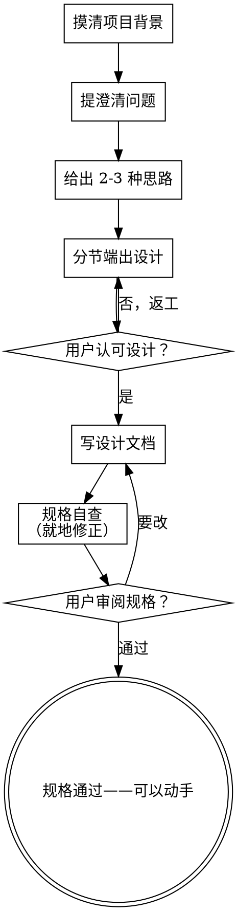

# 把想法打磨成设计

借助自然的协作对话，帮用户把想法谈成成形的设计与规格文档。

先摸清当前项目的来龙去脉，再一次一个问题地把想法问清楚。等想明白要做什么，把设计端出来，请用户拍板。

<HARD-GATE>
在端出设计、并取得用户认可之前，绝不写任何代码、绝不搭建任何项目骨架、绝不动手实现。无论项目看起来多简单，一律如此。
</HARD-GATE>

## 反面套路："这么简单，哪用得着设计"

每个项目都要走这一遍。待办清单、单函数小工具、改个配置——都不例外。恰恰是"简单"项目，最容易因为没人细想的假设而白做一场。设计可以很短（真简单的，几句话足矣），但你必须端出来，必须取得认可。

## 清单

下面每一项你都必须建一个 task，并按顺序完成：

1. **摸清项目背景**——看文件、看文档、看近期变更
2. **提澄清问题**——一次一个，弄清目的、约束、成功标准
3. **给出 2-3 种思路**——连同取舍和你的推荐
4. **端出设计**——分节展开，繁简随其复杂度，每节都先请用户认可再往下
5. **写设计文档**——存到 `docs/<topic>-design.md`
6. **规格自查**——就地快速检查占位符、自相矛盾、歧义、范围（见下文）
7. **用户审阅规格**——往下走之前，请用户过一遍规格文件
8. **交接**——确认规格已认可、已就绪，再问用户打算怎么进入实现

## 流程图

**终点是一份已获认可、已落到纸面的规格。** 头脑风暴期间，绝不写代码、绝不搭项目骨架、绝不开始任何实现。实现只在用户认可规格之后才开始。

## 具体做法

**弄清想法：**

- 先看看项目现状（文件、文档、近期变更）
- 细问之前，先掂量范围：要是需求里摆着好几个互不相干的子系统（比如"做个带聊天、文件存储、计费、分析的平台"），立刻点破。别拿宝贵的提问，去抠一个本该先拆开的项目的细节。
- 项目大到一份规格装不下，就帮用户拆成子项目：哪些是独立的部分，彼此怎么牵连，先做哪个、后做哪个？然后照常规设计流程，先头脑风暴第一个子项目。每个子项目各走一轮"规格 → 实现"。
- 范围合适的项目，就一次一个问题地把想法问细
- 能用选择题就用选择题，开放式的也无妨
- 一条消息只问一个问题——一个话题要深挖，就拆成几问
- 聚焦三件事：目的、约束、成功标准

**探索思路：**

- 给出 2-3 种不同思路，连同各自的取舍
- 用对话的口吻摆出选项，附上你的推荐和理由
- 先说你推荐哪个，再讲为什么

**端出设计：**

- 自认为想清楚要做什么了，就把设计端出来
- 每节繁简随其复杂度：直白的几句话带过，微妙的可写到两三百字
- 每讲完一节，问一句"到这儿对不对"
- 覆盖：架构、组件、数据流、错误处理、测试
- 哪里讲不通，随时回头澄清

**为隔离与清晰而设计：**

- 把系统拆成更小的单元，每个单元只担一桩明确的职责，彼此通过界定清楚的接口往来，各自都能单独理解、单独测试
- 对每个单元，你都该答得上三问：它做什么，怎么用，依赖什么？
- 不读内部实现，能看懂一个单元做什么吗？改动内部，不连累调用方吗？答不上来，就说明边界还没划好。
- 单元更小、边界更清，你自己也更好下手——一眼能装进脑子里的代码，你推敲得更准；文件职责单一，你改起来也更稳。文件一旦膨胀，往往是它揽得太多的信号。

**在现有代码里动工：**

- 提改动之前，先摸清现有结构。顺着已有的写法走。
- 现有代码若有碍手的毛病（文件过大、边界含糊、职责缠在一起），就把对症的改进纳入设计——就像好工程师顺手改好自己正在动的代码。
- 别提不相干的重构。只做服务于当前目标的事。

## 设计定稿之后

**写文档：**

- 把验证过的设计（规格）写进 `docs/<topic>-design.md`
  - （用户若另有规格存放偏好，以用户的为准）
- 写得清楚、简洁——短句，不灌水，不留占位符

**规格自查：**
写完规格文档，换一双眼睛重读一遍：

1. **扫占位符：** 有没有"TBD""TODO"、没写完的小节、含糊的需求？补掉。
2. **前后一致：** 各节之间有没有打架？架构和功能描述对得上吗？
3. **范围核对：** 这一份够聚焦、能一次实现完吗，还是得再拆？
4. **查歧义：** 有没有哪条需求能有两种解读？有，就定下一种，写明白。

发现问题就地改掉。不必再审一轮——改完往下走即可。

**用户审阅这一关：**
自查这一轮过了，往下走之前，请用户过一遍写好的规格：

> "规格已写到 `<path>`。请过目，进入实现之前若想改什么，告诉我。"

等用户回话。要改就改，改完再跑一遍自查。用户认可了，才往下走。

**进入实现：**

- 规格一经认可，就可以动手了。和用户确认下一步怎么走（比如现在就开始实现，还是把规格交给另一道规划/实现的工序）。
- 用户点头之前，不要动笔写代码。

## 要领

- **一次一问**——别一股脑抛一堆问题
- **优先选择题**——比开放式好答
- **狠守 YAGNI**——所有设计里，用不上的功能一律砍掉
- **多看几条路**——定下来之前，总先给 2-3 种思路
- **小步验证**——端出设计，认可了再往下
- **灵活**——哪里讲不通，就回头澄清
